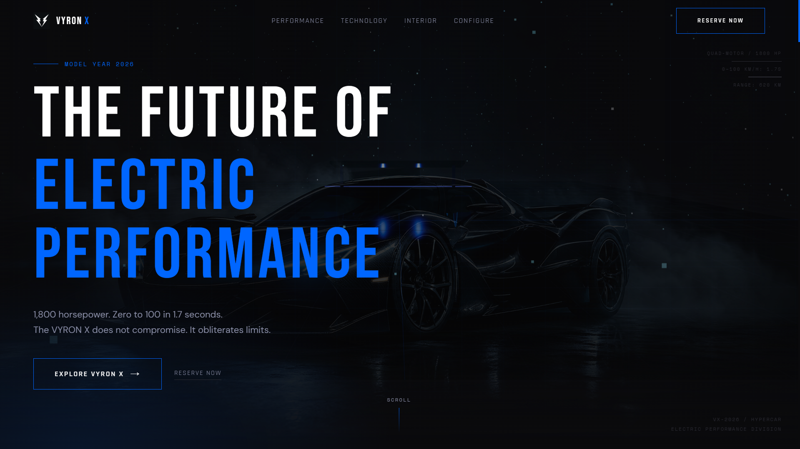
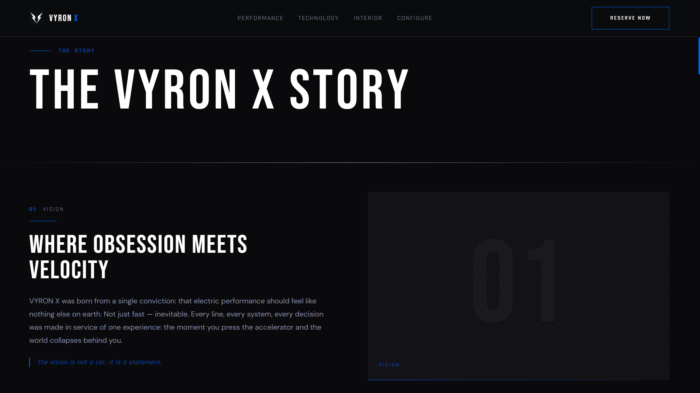
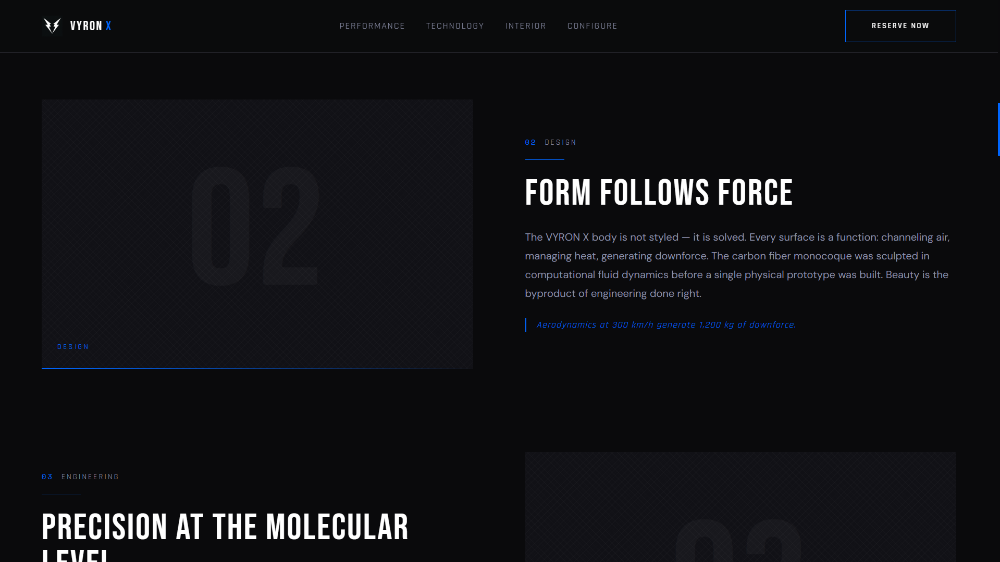
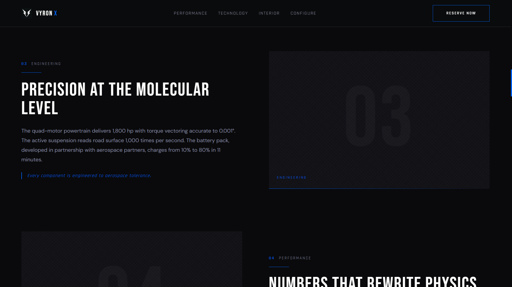
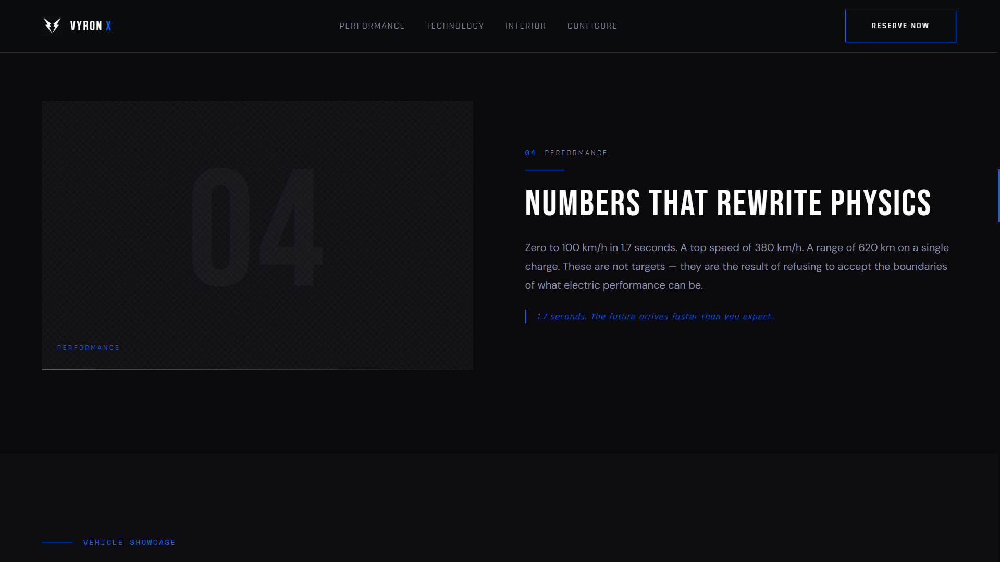
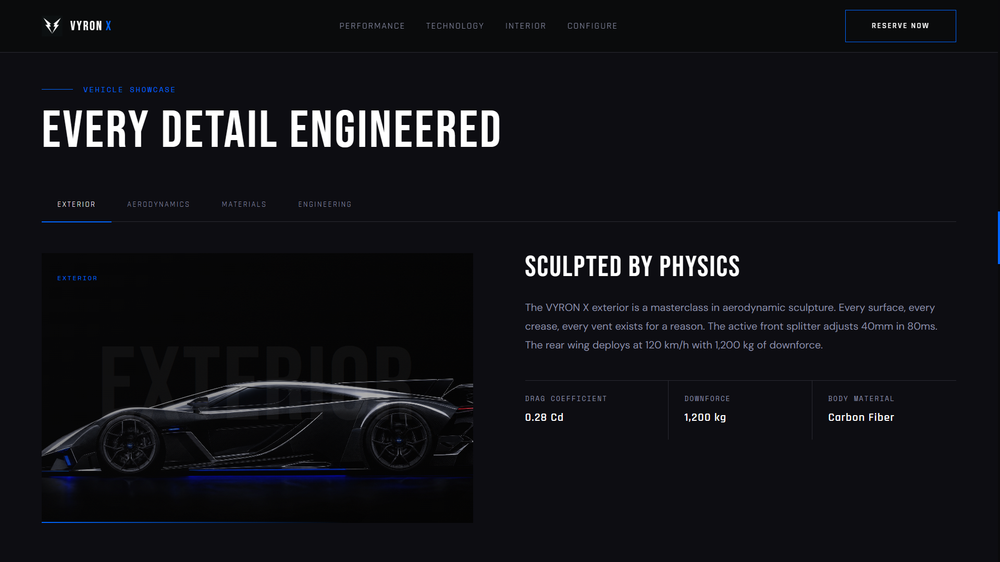
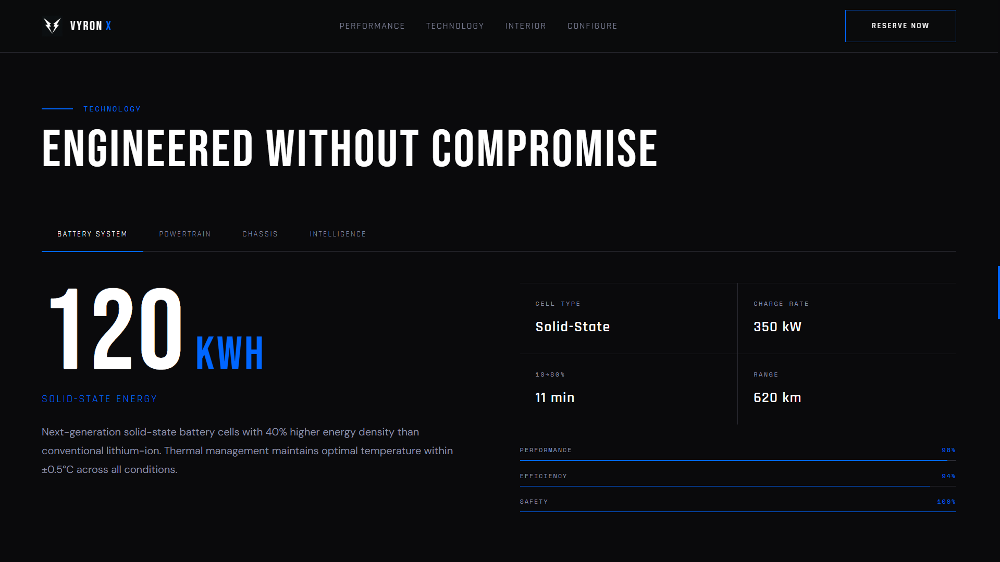
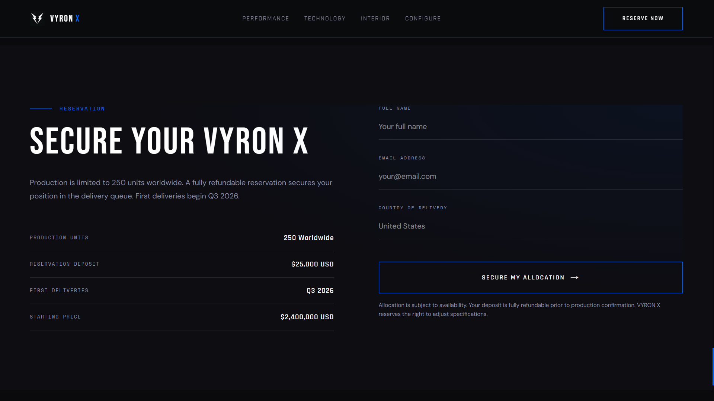
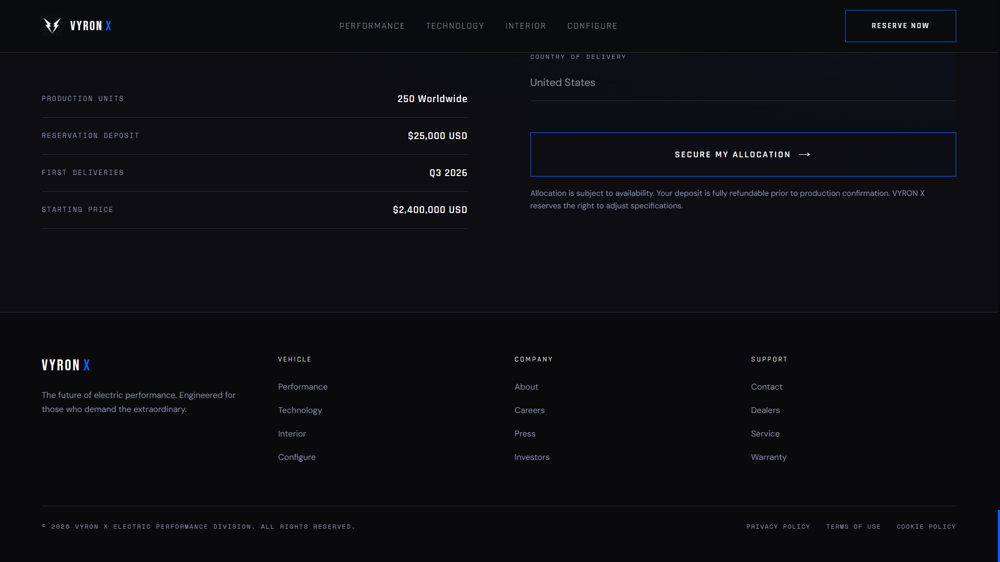
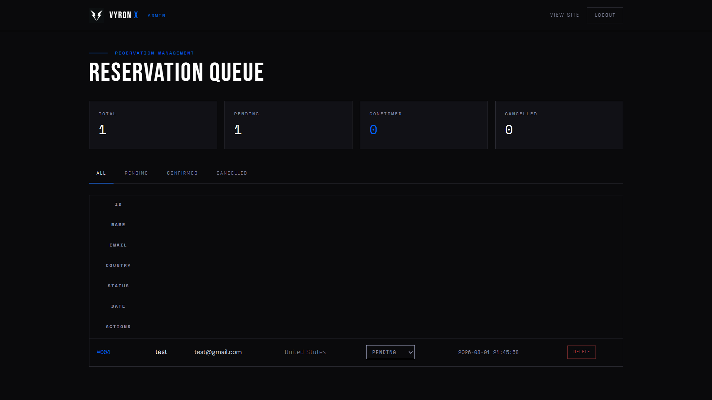

# VYRON X

A premium cinematic luxury electric hypercar experience — a full-stack marketing site with an interactive 3D hero, scroll-driven storytelling, a working reservation system, and an admin dashboard.



---

## Project Overview

VYRON X is a production-grade single-page application for a fictional luxury electric hypercar brand. It combines a cinematic, animated frontend with a real backend: visitors can submit a reservation, and administrators can authenticate and manage the reservation queue from a dedicated dashboard.

The project is intentionally built as a **full-stack demo** suitable for a developer portfolio — it exercises modern React tooling, 3D graphics in the browser, animation engineering, server-side API design, SQL persistence, and secure session authentication.

## Features

- **Cinematic hero** — custom Three.js scene with a stylized 3D hypercar, mouse-reactive parallax, particle system, and a timed GSAP entrance sequence
- **Scroll-driven storytelling** — GSAP ScrollTrigger + Lenis smooth scrolling with per-chapter reveals across four story chapters
- **Interactive vehicle showcase** — tabbed views (Exterior, Aerodynamics, Materials, Engineering) with animated transitions
- **Technology explorer** — tabbed data views with animated counters, detail grids, and progress bars
- **Performance stats** — full-bleed cinematic section with glitch-text headings
- **Reservation system** — public form that persists entries to a SQLite database
- **Admin dashboard** — login-protected panel to view, filter, update, and delete reservations
- **Responsive design** — mobile navigation with animated hamburger menu
- **Design system** — Tailwind CSS v4 with a custom "Electric Obsidian" palette

## Screenshots

| Section | Screenshot |
| --- | --- |
| Hero |  |
| Story |  |
| Story (chapters) |    |
| Technology |  |
| Performance |  |
| Reservation |  |
| Footer |  |
| Admin dashboard |  |

## Technology Stack

**Frontend**

- React 19 + TypeScript
- Vite 7
- Tailwind CSS v4
- Three.js (custom hero scene)
- GSAP + ScrollTrigger
- Lenis smooth scroll
- wouter (tiny router)

**Backend**

- Node.js + Express
- `node:sqlite` — built-in SQLite driver (no native build steps)
- `node:crypto` — HMAC-SHA256 session tokens (no external auth library)

**Tooling**

- pnpm
- esbuild (server bundling)
- Prettier
- shadcn/ui component library

## Architecture Overview

```
Browser (React SPA)
      │
      │  /api/*  (HTTP + JSON)
      ▼
Express middleware  ─── mounted inside Vite dev server (server/app.ts)
      │
      ├── POST /api/reservations        (public)
      ├── POST /api/admin/login         (public)
      ├── POST /api/admin/logout        (public)
      ├── GET  /api/admin/session       (public)
      │
      ├── requireAdmin (HMAC session cookie)
      │
      ├── GET    /api/reservations
      ├── GET    /api/reservations/:id
      ├── PATCH  /api/reservations/:id  (status)
      └── DELETE /api/reservations/:id
      │
      ▼
node:sqlite DatabaseSync  ── data/vyron.db
```

In development, the Express app is mounted as Vite middleware, so a single dev server serves both the SPA and the API. In production on Vercel, the frontend is built as static files and API routes are deployed as serverless functions. For standalone deployment, use `pnpm start` after building.

## Project Structure

```
├── api/                    # Vercel serverless functions
├── client/                 # Frontend (Vite root)
│   ├── public/             # Static assets (images)
│   └── src/
│       ├── components/     # Sections + UI components
│       ├── pages/          # Home, Admin, NotFound
│       ├── contexts/       # Theme context
│       ├── hooks/          # Shared React hooks
│       ├── lib/            # Utilities
│       └── declarations.d.ts
├── docs/screenshots/       # Project screenshots
├── server/
│   ├── app.ts              # Express app factory (routes, validation)
│   ├── auth.ts             # Session tokens, HMAC, cookie helpers
│   ├── db.ts               # SQLite layer (node:sqlite)
│   └── index.ts            # Server entry (standalone + serverless)
├── vercel.json             # Vercel deployment configuration
├── vite.config.ts          # Vite config + API middleware wiring
├── package.json
└── tsconfig.json
```

## Installation Guide

**Prerequisites**

- Node.js 22.5+ (required for the built-in `node:sqlite` module)
- pnpm 10+

```bash
# 1. Clone the repository
git clone https://github.com/DEQUA-A/vyron-x.git
cd vyron-x

# 2. Install dependencies
pnpm install

# 3. Start the development server
pnpm dev
```

Open http://localhost:3000 — Vite automatically finds a free port if 3000 is occupied.

## Environment Variables

All variables are optional. Sensible development defaults are provided, but **you must override them in production**.

| Variable | Description | Default |
| --- | --- | --- |
| `PORT` | Production server port | `3000` |
| `ADMIN_USERNAME` | Admin login username | `admin` |
| `ADMIN_PASSWORD` | Admin login password | `vyron2026` |
| `ADMIN_SECRET` | HMAC secret used to sign session tokens | `vyron-x-dev-secret-change-me` |

Set these in the Vercel dashboard under **Settings → Environment Variables**, or create a `.env` file locally.

Example `.env` file:

```
PORT=3000
ADMIN_USERNAME=admin
ADMIN_PASSWORD=change-this-in-production
ADMIN_SECRET=a-long-random-secret-at-least-32-characters
```

## Development Commands

| Command | Description |
| --- | --- |
| `pnpm dev` | Start the Vite dev server (frontend + API middleware) |
| `pnpm dev:server` | Run the Express server in watch mode (`tsx watch`) |
| `pnpm build` | Build the frontend (`dist/public`) for Vercel deployment |
| `pnpm start` | Run the standalone production server (`node dist/index.js`) |
| `pnpm preview` | Preview the production build |
| `pnpm check` | Type-check the project (`tsc --noEmit`) |
| `pnpm format` | Format code with Prettier |

## Production Build Instructions

```bash
pnpm install
pnpm build
```

The build produces:

- `dist/public/` — optimized static frontend assets (served by Vercel)
- `api/` — Vercel serverless functions (deployed automatically)

## Deploying to Vercel

1. Push the repository to GitHub
2. Import the project at [vercel.com/new](https://vercel.com/new)
3. Vercel automatically detects the Vite framework and `vercel.json` configuration
4. Set the following environment variables in the Vercel dashboard:
   - `ADMIN_USERNAME` — admin login username
   - `ADMIN_PASSWORD` — admin login password
   - `ADMIN_SECRET` — a long random string for session signing
5. Deploy

The frontend is served as static files and API routes are handled as serverless functions. SPA routing is handled by Vercel rewrites that serve `index.html` for non-API paths.

Run it:

```bash
pnpm start
```

The server serves the static SPA, falls back to `index.html` for client-side routes, and exposes the API under `/api/*`. Set `PORT`, `ADMIN_USERNAME`, `ADMIN_PASSWORD`, and `ADMIN_SECRET` before deploying.

## API Documentation

**Base URL:** `/api`

### Health check

```
GET /api/health
```

Returns `200` with `{ status: "ok", timestamp }`.

### Create a reservation (public)

```
POST /api/reservations
Content-Type: application/json
```

Request body:

```json
{
  "name": "Jane Doe",
  "email": "jane@example.com",
  "country": "United States"
}
```

Validation requires all three fields; `email` must match a simple email pattern. Returns `201` with the created reservation, or `400` with an error message.

### Admin login (public)

```
POST /api/admin/login
Content-Type: application/json
```

```json
{ "username": "admin", "password": "your-password" }
```

On success, sets an `HttpOnly` session cookie (`vyron_admin_session`) and returns `{ success: true, username }`.

### Admin logout (public)

```
POST /api/admin/logout
```

Clears the session cookie.

### Check session (public)

```
GET /api/admin/session
```

Returns `{ authenticated: true, username }` or `401` with `{ authenticated: false }`.

### List reservations (admin only)

```
GET /api/reservations
```

Requires a valid session cookie. Returns all reservations, newest first.

### Get a reservation (admin only)

```
GET /api/reservations/:id
```

Returns a single reservation or `404`.

### Update reservation status (admin only)

```
PATCH /api/reservations/:id
Content-Type: application/json
```

```json
{ "status": "confirmed" }
```

Allowed statuses: `pending`, `confirmed`, `cancelled`. Returns the updated reservation.

### Delete a reservation (admin only)

```
DELETE /api/reservations/:id
```

Returns `204` on success or `404` if not found.

## Admin Dashboard

Navigate to `/admin`:

1. Sign in with the admin credentials (see Environment Variables).
2. The dashboard shows four summary cards — Total, Pending, Confirmed, Cancelled.
3. Use the filter tabs to view a specific status.
4. Change a reservation's status inline with the status dropdown.
5. Delete a reservation with the **Delete** button (requires confirmation).

The panel is a separate route in the SPA and calls the admin-protected API endpoints with `credentials: "include"`.

## Security Considerations

- **Session cookies** are `HttpOnly` and `SameSite=Lax` to mitigate XSS cookie theft and CSRF. In production (HTTPS), the `Secure` flag is also set.
- **Password comparison** uses `crypto.timingSafeEqual` to resist timing attacks.
- **Session tokens** are HMAC-SHA256 signed with `ADMIN_SECRET`, and expire after 12 hours.
- **SQL injection** is prevented via prepared statements throughout the database layer.
- **API validation** — all inputs are validated and the reservation email must match a strict pattern.
- **Production defaults** — the default credentials and secret in this repo are for local development only. **Always** override `ADMIN_USERNAME`, `ADMIN_PASSWORD`, and `ADMIN_SECRET` in any deployed environment.
- **Vercel security** — Vercel provides automatic HTTPS, DDoS protection, and IP rate limiting on its platform. Environment variables are encrypted at rest and injected at runtime.

## Performance Optimizations

- Three.js hero scene is **lazy-loaded** and only renders after the main bundle
- `renderer.setPixelRatio(Math.min(devicePixelRatio, 2))` caps pixel ratio on high-DPI displays
- `gsap.ticker.lagSmoothing(0)` for consistent animation timing
- Vite production build with code splitting and asset hashing
- Hero background image is shown as a static fallback before the WebGL canvas mounts

## Future Roadmap

- Email confirmation on reservation submission
- Pagination and search for the admin reservation queue
- Persistent admin account table with hashed passwords
- CSV export of reservations
- Rate limiting on the login endpoint
- i18n support

## Author

Built as a full-stack developer portfolio project.

**Author:** [DEQUA-A](https://github.com/DEQUA-A)

---

## License

This project is licensed under the [MIT License](LICENSE). All vehicle imagery is fictional concept art created for demonstration purposes.